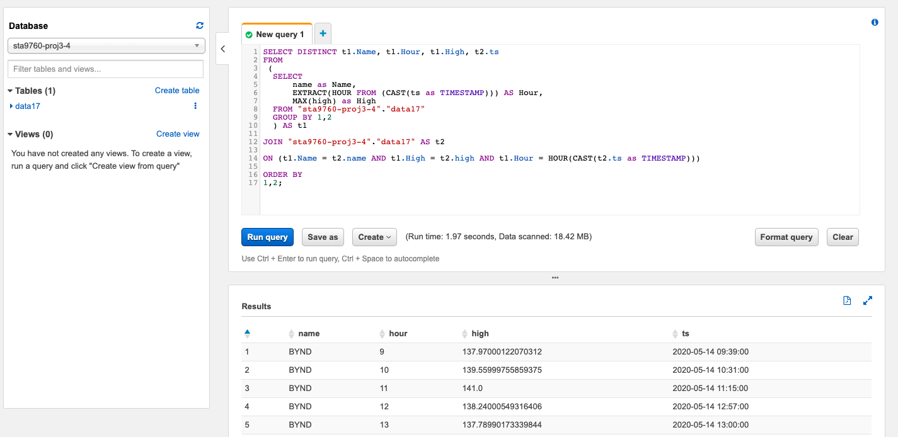

# STA9760-Streaming-With-AWS-Lambda

#### Goal for Project 3: Provision Lambda functions to generate near real time finance data records for downstream processing and interactive querying.

1. Utilizing a `AWS Lambda` function to collect information of few stocks.  `yfinance` module is used in this data collection process. 
2. Using another Lambda function to transform the data collected and stream to designate S3 bucket. It will transform the data with AWS `Kinesis Firehose Delivery Stream` service. 
3. Configuring a `AWS Glue` that pointing to the S3 Bucket created during the transformation proccess. 
4. Glue with `AWS Athena` for interactive querying.

URL for DataCollector: https://1jxy4na23d.execute-api.us-east-2.amazonaws.com/default/project3-datacollector-1

( Note: use the `TEST` button when generating data during the collection proccess, regardless of input format. )

#### DataCollector Lambda configuration page

#### Kinesis Data Firehose Delivery Stream Monitoring

#### Querying Data in AWS Athena

Trying to find the highest stock price of each hour per company. Query outputs are saved to `results.csv`. 

Some simple visuals are generated using jupyter notebook.
